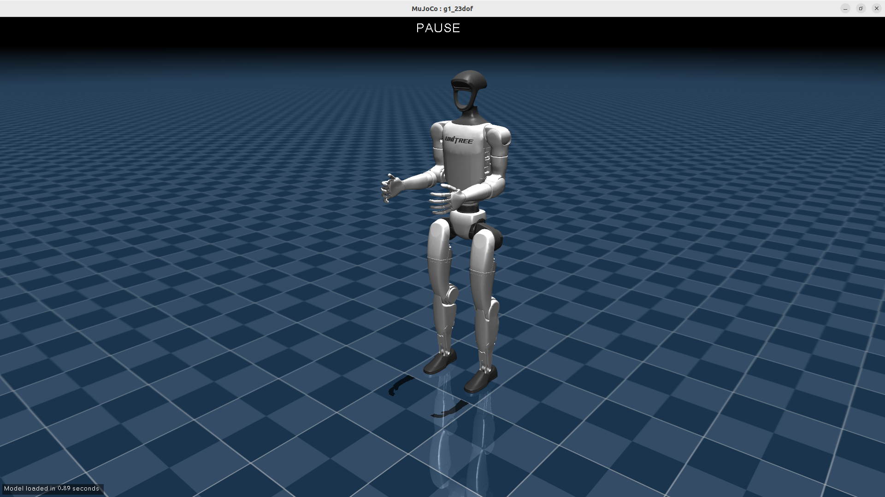
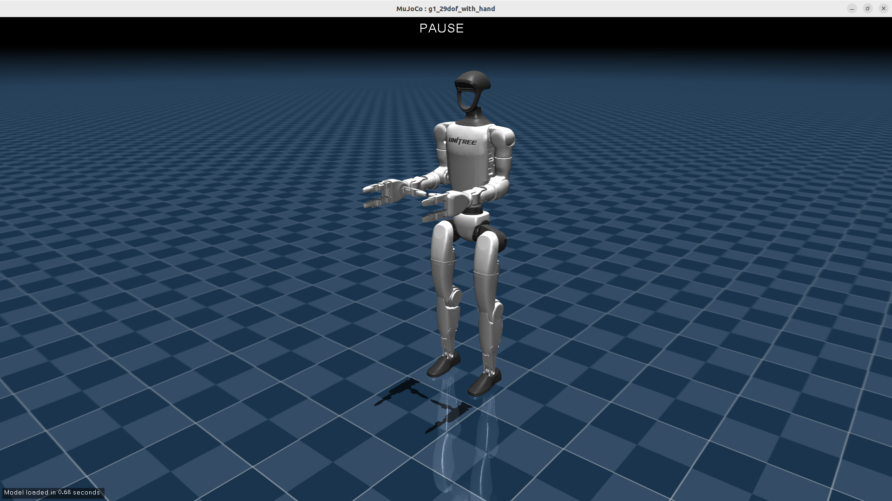
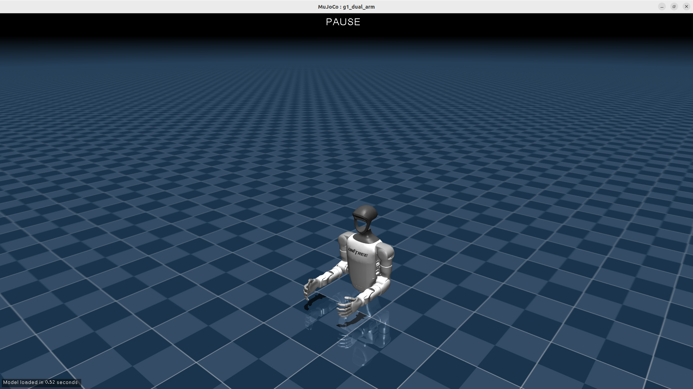

# Unitree G1 Description (URDF & MJCF)

## Overview

This package includes a streamlined robot description (URDF & MJCF) for the [Unitree G1](https://www.unitree.com/g1/), developed by [Unitree Robotics](https://www.unitree.com/).

  
  
  
  

As shown, there are a total of 4 versions of MJCF/URDF for the G1 robot:

* `g1_23dof`
* `g1_29dof`
* `g1_29dof_with_hand`
* `g1_dual_arm`
